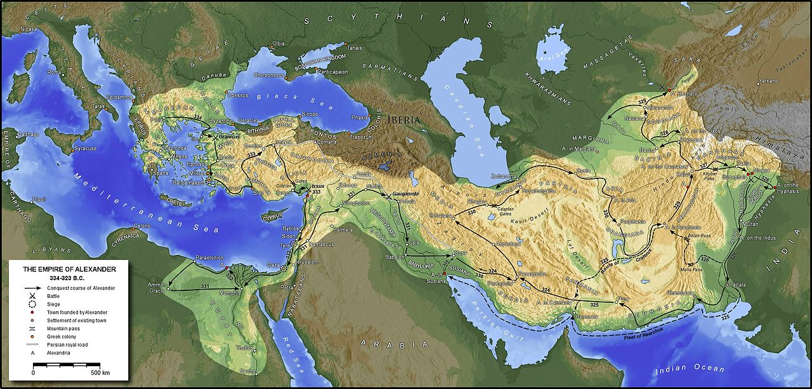
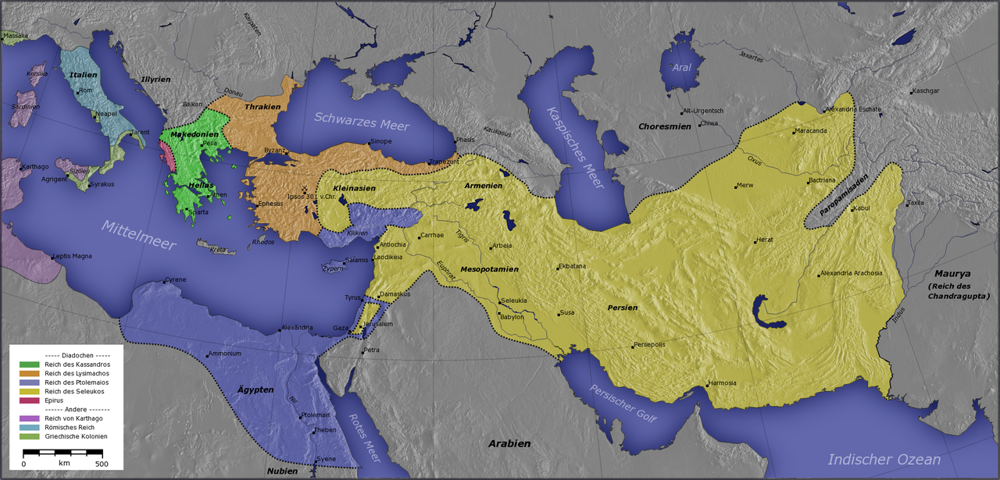
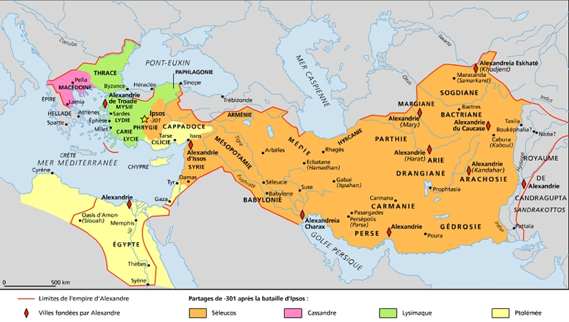

# Alexandre le grand

## Empire d'alexandre
Empire d'Alexandre (Wikipedia) : 

## Succession
Partage en 281 (Wikipedia) :

Légende 
Bleu foncé : royaume ptolémaique, 
Jaune : royaume séleucide, 
Orange : royaume de Lysimaque
Vert : macédoine

Partage en 301 (Wikipedia) :

