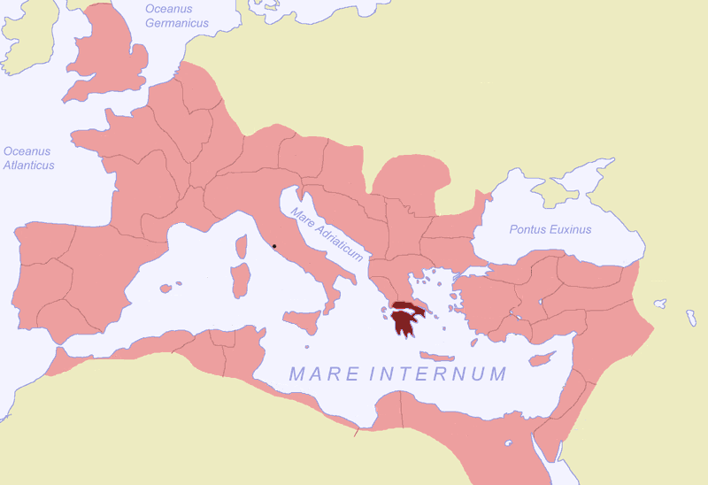
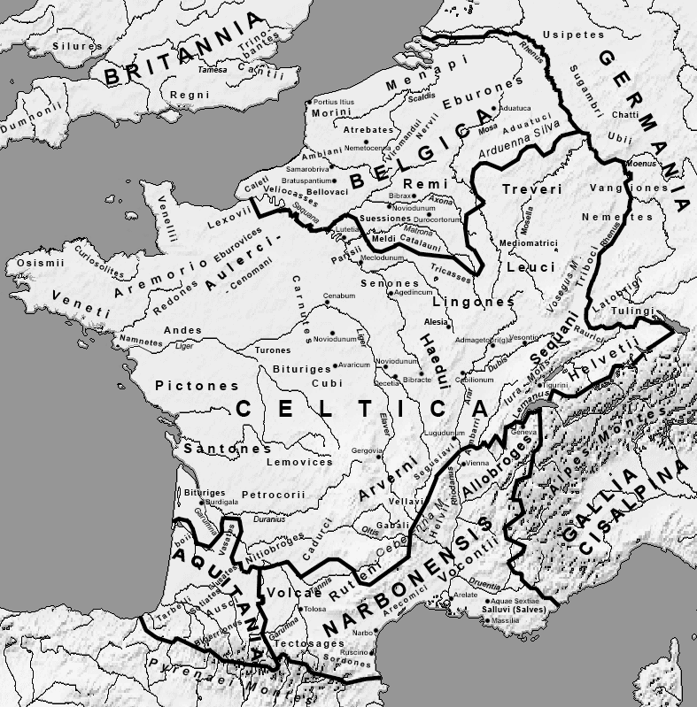
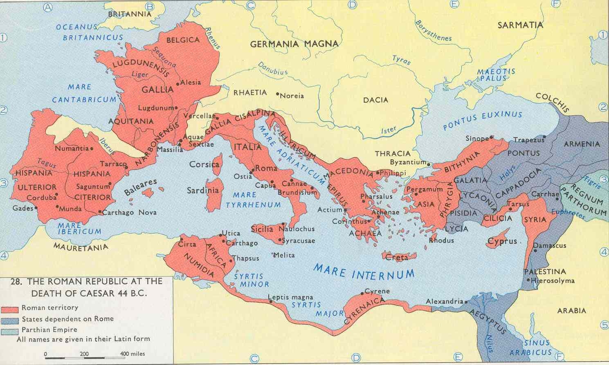

# Rome antique
## République
Guerre d'Achaïe et création de la province du même nom :

[« Achaea SPQR ». Sous licence CC BY-SA 3.0 via Wikimedia Commons](https://commons.wikimedia.org/wiki/File:Achaea_SPQR.png#/media/File:Achaea_SPQR.png)

## Guerre des gaules
Tribus gauloises (Wikipedia) :

Empire à la mort de César

(stpaulscollege.ie)

